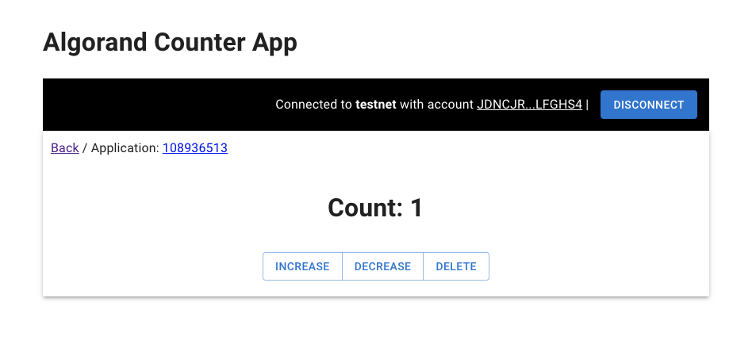

# Algorand - Counter Application

This project lets you count on the Algorand blockchain. It serves as an **educational** example on how to build, test, and deploy a very basic application on the Algorand blockchain.

The application is built using the [PyTeal](https://pyteal.readthedocs.io/en/stable/) and [Beaker](https://github.com/algorand-devrel/beaker) libraries, the frontend
is written in React / TypeScript and uses the [Javascript Algorand SDK](https://github.com/algorand/js-algorand-sdk) with [WalletConnect](https://walletconnect.com/) for wallet-application interaction.

Try it out:

## Project Layout

- [`application`](./application), contains the application written in PyTeal and some convenience tools for compilation and deployment
- [`client`](./client), contains a React web frontend for interacting with the application

## Known Issues

- Connecting the dApp to a locally running Algorand node through WalletConnect + Pera Wallet does not work. Pera wallet currently only allows connecting to either testnet or mainnet.    